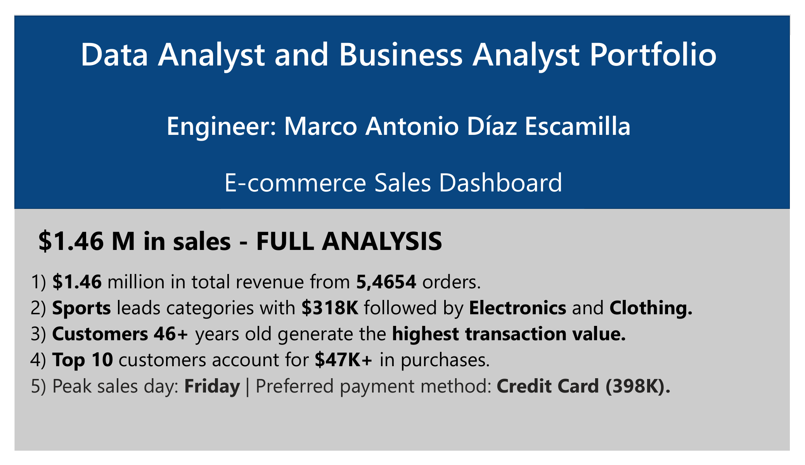
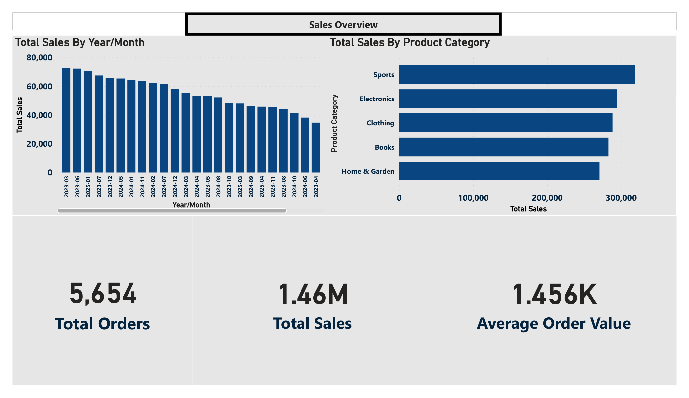
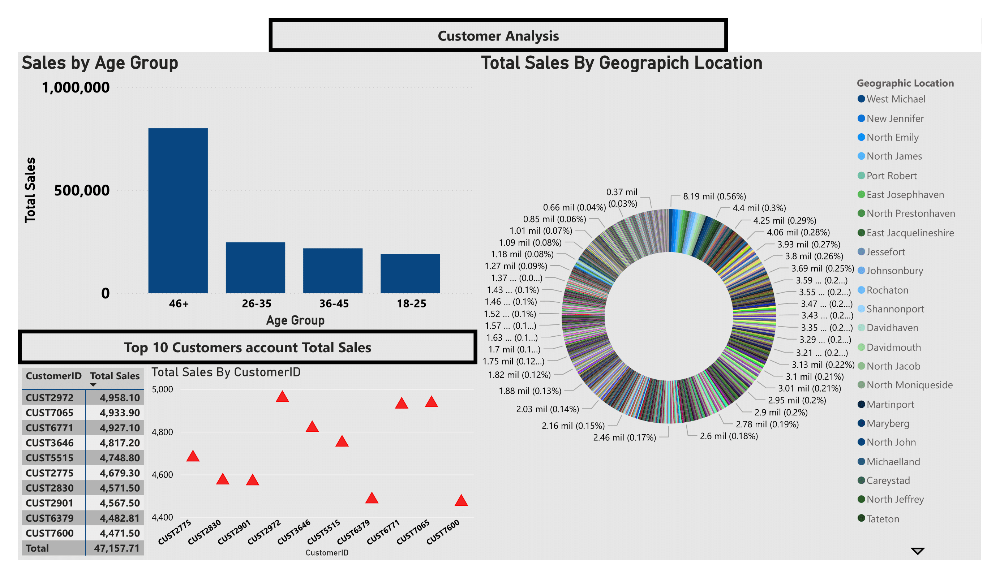
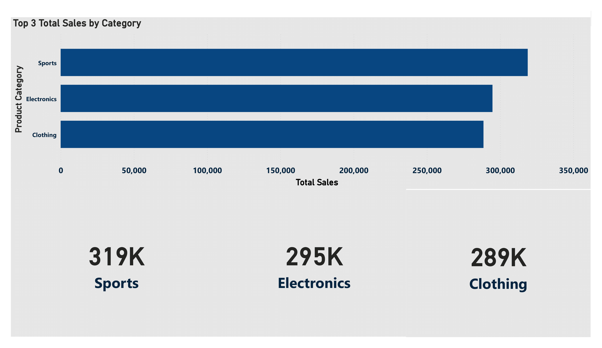
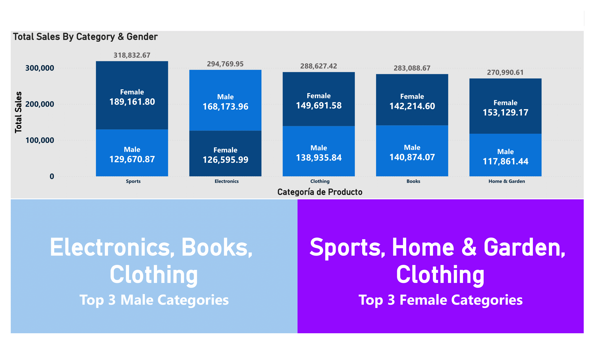
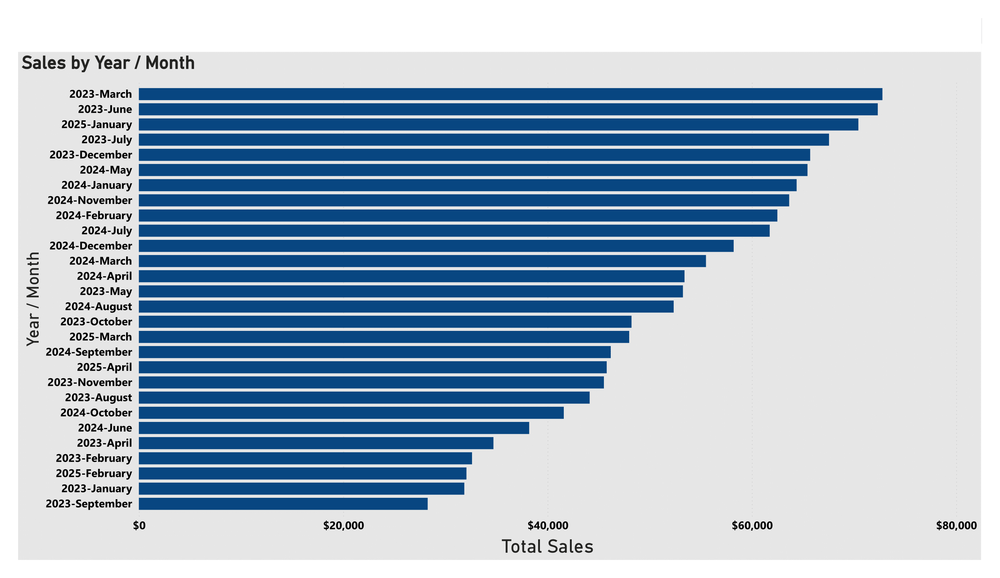
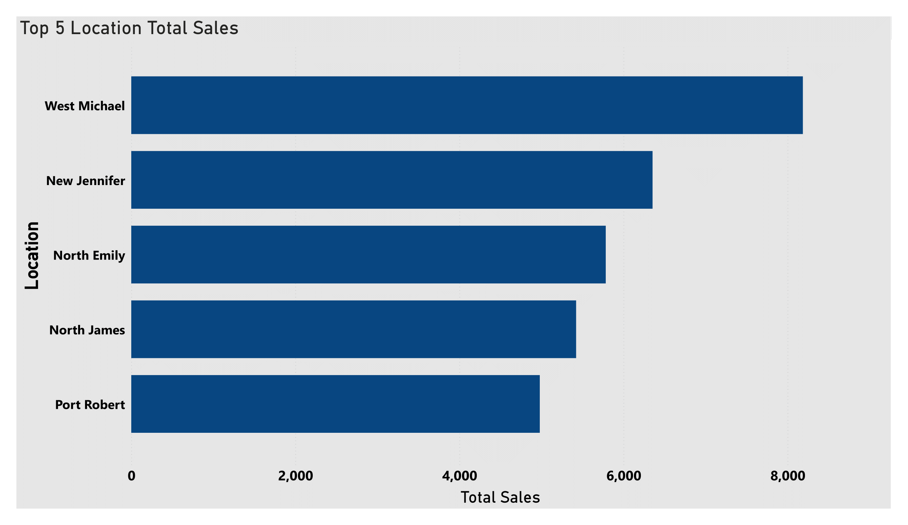

# Data Analyst & Business Analyst Portfolio

 

## E-commerce Sales Dashboard – $1.46M Full Analysis
Interactive **Power BI** dashboard analyzing **$1.46 million** in sales across **5,654 orders** from a multi-category e-commerce business (2023 – 2025).

## Portfolio Preview (8 Pages – Updated December 2025)

---

### Key Business Insights
- **Total Sales**: **$1,456,309** from **5,654 orders**
- **Average Order Value**: **$1,456**
- **Top Category**: **Sports** → **$319K** (21.9%)
- **Top 3 Categories**:
  1. Sports → $319K
  2. Electronics → $295K
  3. Clothing → $289K
- **Highest-Spending Segment**: Customers **46+ years old**
- **Top 10 customers** contribute **over $47K** in revenue
- **Peak sales day**: **Friday**
- **Preferred payment method**: **Credit Card** → **$398K** (27%)
- **Gender Insights**:
  - Women spend more than men in **Sports** ($189K vs $129K)
  - Men dominate **Electronics** ($168K vs $126K)
  - **Top 3 Male Categories**: Electronics, Books, Clothing
  - **Top 3 Female Categories**: Sports, Home & Garden, Clothing
- **Best month ever**: March 2023 (~$78K)
- **Top 5 Location Total Sales**: West Michael, New Jennifer, North Emily, North James & Port Robert

### Dashboard Features & Visualizations – 8 Pages
| Page | Section                              | Visualization Type                          |
|------|----------------------------------------|---------------------------------------------|
| 1    | Executive Summary                      | KPI Cards + Monthly Trend Line              |
| 2    | Sales by Product Category & Geography  | Horizontal Bar + Sunburst Chart             |
| 3    | Customer Analysis                      | Age Groups Column + Top 10 Customers Table  |
| 4    | Sales by Day & Payment Method          | Line Chart + Column + Detailed Matrix       |
| 5    | Top 3 Categories Deep Dive             | Large KPI Cards + Horizontal Bar Chart      |
| 6    | Sales by Category & Gender             | 100% Stacked Column Chart + Custom Banners  |
| 7    | Monthly Sales Evolution (2023-2025)    | Chronological Horizontal Bar Chart          |
| 8    | Top 5 Location Total Sales             | Clustered Bar Chart                         |

### Features (Pages 5-8)
- Top 3 categories with exact values (319K / 295K / 289K)
- Gender segmentation across all categories (100% stacked columns)
- Custom Top 3 Male & Top 3 Female category banners (purple & blue)
- Full monthly sales history (2023 → 2025) with chronological ordering
- Top 5 Location Total Sales
- Conditional formatting and dynamic titles using advanced DAX

### Repository Contents
- [Portfolio.pdf](https://github.com/MarcoData2/Data-Analyst-Business-Analyst-Portfolio/blob/main/Portfolio.pdf?raw=true) → Full dashboard export
- `DASHBOARD.pbix` → Interactive Power BI file
- `synthetic_ecommerce_data.csv` → Synthetic dataset used

### Tools & Skills Demonstrated
- Power BI Desktop (Data Modeling & Advanced Design)
- Power Query (ETL & Data Cleaning)
- Advanced DAX Measures (ranking, segmentation, conditional formatting)
- Interactive filters, drill-through, bookmarks, custom tooltips
- Professional design & data storytelling

---
## Full PDF Version (9 Pages)

 

### Contact
**Email**: marcoad160@gmail.com  
**Phone**: (+52) 55 6400-3686  
**LinkedIn**: [linkedin.com/in/marcodata19](https://www.linkedin.com/in/marcodata19)  

Feel free to contact me if you want to view the interactive `.pbix` file or discuss projects in **Power BI, Excel, SQL Server, MySQL, Python, Unix/bash**, Report Builder, AWS, GCP, and more!

 

Built with passion and lots of DAX by **Marco Data** — 2025
