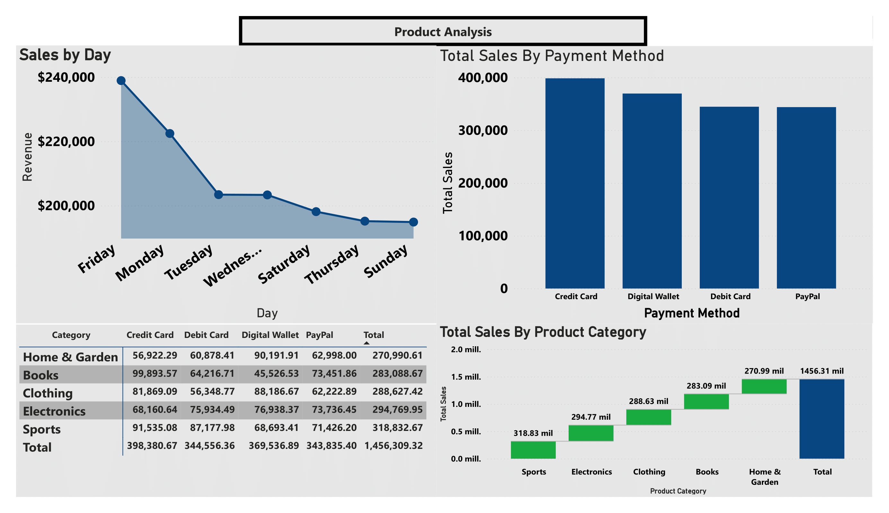

# Data Analyst & Business Analyst Portfolio

 

## E-commerce Sales Dashboard – Full $1.46M Revenue Analysis
Interactive **Power BI** dashboard analyzing **$1.46 million USD** in sales across **5,654 orders** from a multi-category e-commerce business (2023 – 2025).

## Portfolio Preview (8 pages – Updated December 2025)

---
### Key Business Insights
- **Total Revenue**: **$1,456,309** | 5,654 orders
- **Average Order Value**: **$1,456**  
- **Top Category**: Sports → **$319K** (21.9%)
- **Top 3 Categories**: Sports ($319K) → Electronics ($295K) → Clothing ($289K)
- **Highest-Spending Segment**: Customers **46+ years old**
- **Top 10 customers** contribute **>$47K** in revenue
- Peak sales day: **Friday** | Preferred payment: **Credit Card** ($398K)
- Women outspend men in Sports | Men dominate Electronics
- Best month ever: March 2023 (~$78K)

### Dashboard Features (8 interactive pages)
| Page | Focus Area                          | Visualization Type                          |
|------|-------------------------------------|---------------------------------------------|
| 1    | Executive Summary                   | KPI Cards + Monthly Trend Line              |
| 2    | Sales by Category & Geography       | Horizontal Bars + Sunburst Chart            |
| 3    | Customer Analysis                   | Age Groups + Top 10 Customers Table         |
| 4    | Sales by Day & Payment Method       | Line + Column + Detailed Matrix             |
| 5    | Top 3 Categories Deep Dive          | Large KPIs + Horizontal Bars                |
| 6    | Sales by Category & Gender          | 100% Stacked Columns + Custom Banners       |
| 7    | Monthly Evolution 2023–2025         | Chronological Horizontal Bar                |
| 8    | Top 5 Locations by Revenue          | Clustered Bar Chart                         |

**Advanced Features**  
- Complex DAX measures (dynamic ranking, conditional segmentation, dynamic titles & formatting)  
- Simulated real-world ETL process extracting data from **SQL Server** and **AWS Redshift**-like structures using Power Query  
- Interactive filters, drill-through, bookmarks, custom tooltips  
- Professional design focused on executive-level data storytelling

### Repository Contents
- [Portfolio.pdf](https://github.com/MarcoData2/Data-Analyst-Business-Analyst-Portfolio/blob/main/Portfolio.pdf?raw=true) → Full dashboard export (9 pages)  
- `DASHBOARD.pbix` → Interactive Power BI file  
- `synthetic_ecommerce_data.csv` → Source synthetic dataset

### Tools & Skills Demonstrated
- Power BI (Data Modeling, Advanced DAX, Dashboard Design)  
- Power Query (simulated enterprise ETL pipelines)  
- SQL Server & cloud data warehouse concepts (AWS Redshift pattern)  
- Excel Advanced  
- **Python** for data processing and automation when required  
- Unix environment experience  
- Business-oriented data visualization & storytelling

---
## Full PDF Version (9 pages)

 

### Looking for a Data Analyst who delivers actionable business insights?
I’m actively open to **Data Analyst, Business Intelligence Analyst, or BI & Analytics roles** at data-driven companies.

Let’s connect and discuss how I can help your team turn raw data into strategic advantages.

**Contact**  
📧 **Email**: [marcoad160@gmail.com](mailto:marcoad160@gmail.com)  
📱 **Phone / WhatsApp**: (+52) 55 6400-3686  
💼 **LinkedIn**:   
🐙 **GitHub**: https://github.com/MarcoData2  

*Based in Mexico City | Open to relocation abroad (relocation expenses covered) | Available for remote, hybrid or onsite roles worldwide*
